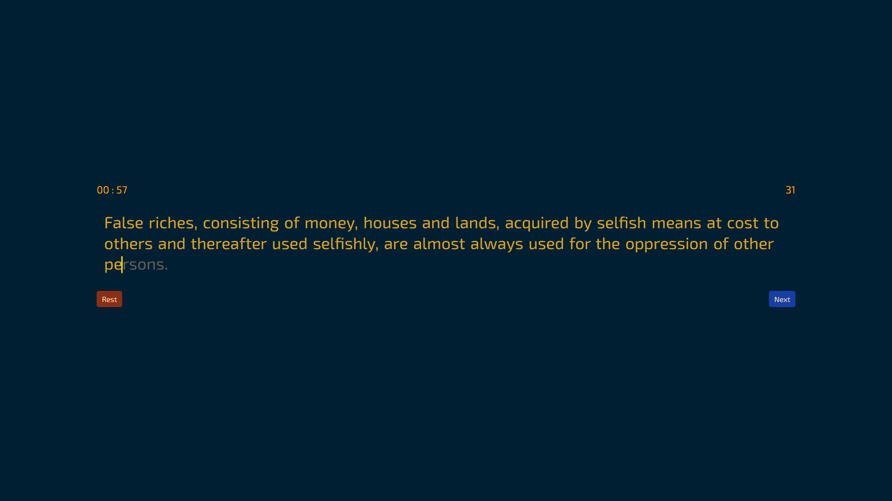

# type up ⌨️

### Speed Typing Test
---
اپلیکیشن تست سرعت تایپ ساخته‌شده با Vanilla JavaScript، HTML و CSS.  
با استفاده از نقل‌قول‌های تصادفی، کاربر سرعت و دقت تایپ خودش رو بررسی می‌کنه.

---

### 🎯 امکانات

 دریافت نقل‌قول‌های تصادفی از API

 نمایش لحظه‌ای تایمر و مکان تایپ با یک نشانگر متحرک (pipe)
 
 محاسبه سرعت تایپ (کلمه در دقیقه)

 تشخیص و نمایش حروف صحیح و اشتباه با رنگ متفاوت

 نمایش نتیجه‌ی نهایی با جزئیات (زمان، تعداد کلمات، سرعت)
 رابط کاربری ساده و واکنش‌گرا

---

### 📸 پیش‌نمایش



 ## [link demo ...](https://alireza-shokri.github.io/TypeUP/)

<!-- --- -->

### 🛠 تکنولوژی‌ها

- HTML5
- CSS3 (به‌همراه Animation و Responsive Design)
- JavaScript (Vanilla JS)
- [API Ninjas - Quotes](https://api-ninjas.com/api/quotes) (گرفتن تکست  (نقل فول))

---

### 🚀 اجرا و استفاده

#### 1. کلون کردن پروژه

```bash
git clone https://github.com/your-username/typing-speed-test.git
```
#### 2. وارد پوشه پروژه شوید:
```bash
cd weather-app
```

#### 3. فایل `index.html` را با مرورگر باز کنید.

> ###  توجه : برای دریافت نقل‌قول‌ها از API باید یک کلید (API Key) از API Ninjas دریافت کرده و در فایل JavaScript جایگزین کنید:
```bash
const API_KEY = "YOUR_API_KEY_HERE";
```
---
> ### open source    🌱
